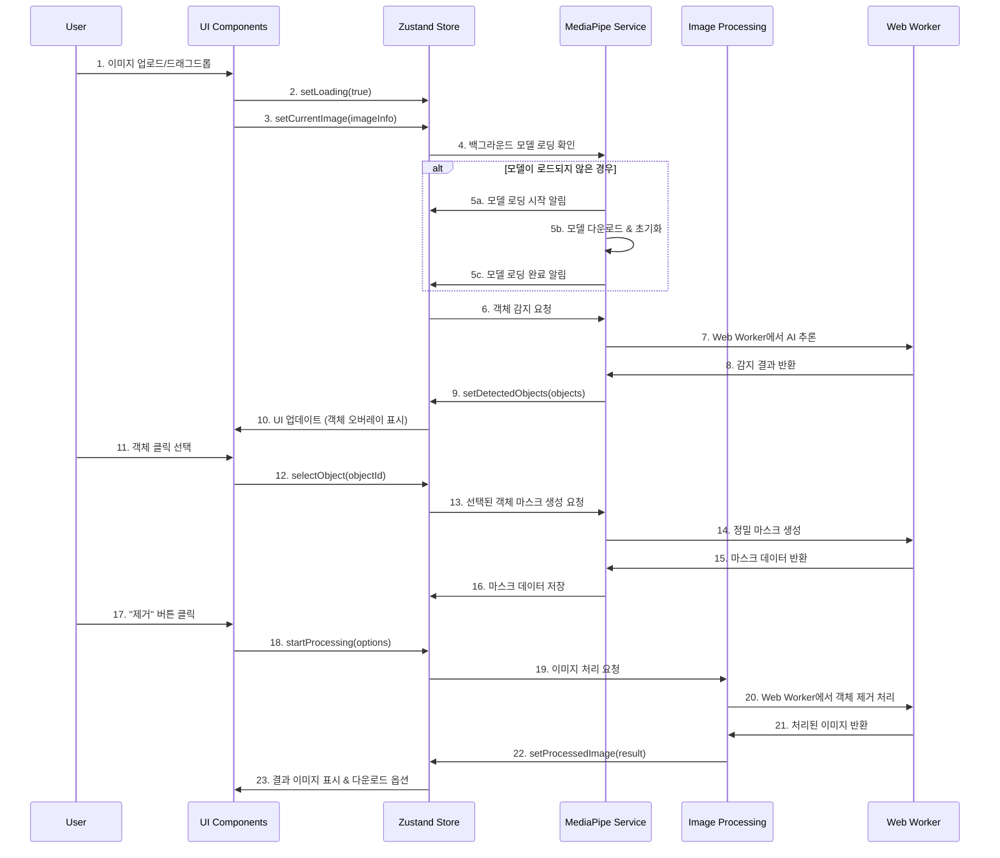

# 🔄 **Magic Photo Editor - 데이터 흐름도**
*Claude Code 개발을 위한 완전한 상태 관리 및 데이터 처리 흐름*

---

## 📊 **문서 정보**
- **작성일**: 2025-09-16
- **버전**: v1.0
- **대상**: Claude Code 개발 + 상태 관리 최적화
- **우선순위**: Critical ⭐⭐⭐⭐⭐

---

## 🎯 **목적 및 범위**
이 문서는 Magic Photo Editor의 모든 데이터 흐름을 시각화하고, 상태 변화 과정을 명확히 정의하여 Claude Code에서 안정적이고 예측 가능한 애플리케이션을 구현할 수 있도록 합니다.

---

## 🌊 **1. 전체 데이터 흐름 시퀀스**

### **📋 메인 워크플로우**


### **🔄 상세 처리 단계**
```typescript
interface DataFlowSteps {
  // Step 1: 파일 입력 처리
  fileInput: {
    trigger: "File selection or drag & drop"
    validation: [
      "validateFileType()",
      "validateFileSize()",
      "validateImageIntegrity()"
    ]
    stateChanges: [
      "isLoading: false → true",
      "error: null",
      "currentImage: null → ImageInfo"
    ]
    nextStep: "imageLoading"
  }
  
  // Step 2: 이미지 로딩 및 분석
  imageLoading: {
    trigger: "Valid file uploaded"
    processes: [
      "fileToImage() conversion",
      "imageToCanvas() for processing",
      "extractImageMetadata()"
    ]
    stateChanges: [
      "currentImage: ImageInfo populated",
      "canvasContext: created"
    ]
    nextStep: "modelInitialization"
  }
  
  // Step 3: AI 모델 초기화
  modelInitialization: {
    trigger: "Image loaded successfully"
    processes: [
      "checkModelCache()",
      "loadMediaPipeModels()",
      "initializeGPUBackend() if available"
    ]
    stateChanges: [
      "aiModelsLoaded: false → true",
      "modelLoadingProgress: 0 → 100"
    ]
    nextStep: "objectDetection"
  }
  
  // Step 4: 객체 감지
  objectDetection: {
    trigger: "Models initialized"
    processes: [
      "resizeImageForInference()",
      "runObjectDetection()",
      "filterLowConfidenceObjects()",
      "generateBoundingBoxes()"
    ]
    stateChanges: [
      "detectedObjects: [] → DetectedObject[]",
      "isDetecting: true → false"
    ]
    nextStep: "userSelection"
  }
  
  // Step 5: 사용자 선택
  userSelection: {
    trigger: "User clicks on detected object"
    processes: [
      "validateObjectSelection()",
      "highlightSelectedObject()",
      "prepareMaskGeneration()"
    ]
    stateChanges: [
      "selectedObject: null → DetectedObject",
      "canProcess: false → true"
    ]
    nextStep: "maskGeneration"
  }
  
  // Step 6: 마스크 생성
  maskGeneration: {
    trigger: "Object selected"
    processes: [
      "runInteractiveSegmentation()",
      "refineMaskEdges()",
      "applyFeathering()"
    ]
    stateChanges: [
      "objectMask: null → ImageData",
      "isGeneratingMask: true → false"
    ]
    nextStep: "imageProcessing"
  }
  
  // Step 7: 이미지 처리
  imageProcessing: {
    trigger: "User confirms processing"
    processes: [
      "setupProcessingWorker()",
      "removeObjectFromImage()",
      "inpaintBackground()",
      "optimizeResult()"
    ]
    stateChanges: [
      "isProcessing: true",
      "processingProgress: 0 → 100",
      "processedImage: null → HTMLImageElement"
    ]
    nextStep: "resultPresentation"
  }
  
  // Step 8: 결과 표시
  resultPresentation: {
    trigger: "Processing completed"
    processes: [
      "generatePreviewUrls()",
      "prepareDownloadOptions()",
      "updateProcessingHistory()"
    ]
    stateChanges: [
      "isProcessing: false",
      "showResults: true",
      "history: updated with new job"
    ]
    nextStep: "export"
  }
}
```

---

## 📊 **2. 상태 변화 다이어그램**

### **🔄 Zustand Store 상태 전이**
```typescript
interface StateTransitions {
  // 초기 상태 (앱 로드 시)
  initial: {
    currentImage: null
    detectedObjects: []
    selectedObject: null
    objectMask: null
    processedImage: null
    isLoading: false
    isDetecting: false
    isGeneratingMask: false
    isProcessing: false
    error: null
    aiModelsLoaded: false
    processingHistory: []
    userPreferences: DEFAULT_PREFERENCES
  }
  
  // 파일 업로드 상태
  fileUploading: {
    currentImage: null
    isLoading: true
    error: null
    // 나머지 상태 유지
  }
  
  // 이미지 로드 완료 상태
  imageLoaded: {
    currentImage: ImageInfo
    detectedObjects: []
    isLoading: false
    canDetect: true
    // AI 모델 로딩이 완료되지 않은 경우 감지 불가
  }
  
  // 객체 감지 진행 상태
  detecting: {
    currentImage: ImageInfo
    detectedObjects: []
    isDetecting: true
    selectedObject: null
    // 사용자는 대기 상태
  }
  
  // 객체 감지 완료 상태
  objectsDetected: {
    currentImage: ImageInfo
    detectedObjects: DetectedObject[]
    isDetecting: false
    canSelect: true
    // 사용자가 객체 선택 가능
  }
  
  // 객체 선택됨 상태
  objectSelected: {
    currentImage: ImageInfo
    detectedObjects: DetectedObject[]
    selectedObject: DetectedObject
    isGeneratingMask: false
    canProcess: true
    // 처리 옵션 설정 및 실행 가능
  }
  
  // 마스크 생성 중 상태
  maskGenerating: {
    selectedObject: DetectedObject
    isGeneratingMask: true
    objectMask: null
    canProcess: false
    // 마스크 생성 완료까지 대기
  }
  
  // 마스크 생성 완료 상태
  maskReady: {
    selectedObject: DetectedObject
    objectMask: ImageData
    isGeneratingMask: false
    canProcess: true
    showPreview: true
    // 미리보기 가능, 처리 실행 준비
  }
  
  // 이미지 처리 중 상태
  processing: {
    selectedObject: DetectedObject
    objectMask: ImageData
    isProcessing: true
    processingProgress: number // 0-100
    processedImage: null
    canCancel: true
    // 진행률 표시, 취소 가능
  }
  
  // 처리 완료 상태
  processingComplete: {
    currentImage: ImageInfo
    processedImage: HTMLImageElement
    isProcessing: false
    showResults: true
    canDownload: true
    canShare: true
    processingHistory: [...history, newJob]
    // 결과 확인, 다운로드, 공유 가능
  }
  
  // 에러 상태 (언제든 발생 가능)
  errorState: {
    error: ProcessingError
    isLoading: false
    isDetecting: false
    isGeneratingMask: false
    isProcessing: false
    canRetry: boolean
    // 에러 메시지 표시, 복구 옵션 제공
  }
}
```

### **🔄 상태 전이 규칙**
```typescript
interface StateTransitionRules {
  allowedTransitions: {
    initial: ['fileUploading', 'errorState']
    fileUploading: ['imageLoaded', 'errorState']
    imageLoaded: ['detecting', 'errorState']
    detecting: ['objectsDetected', 'errorState']
    objectsDetected: ['objectSelected', 'detecting', 'errorState']
    objectSelected: ['maskGenerating', 'processing', 'detecting', 'errorState']
    maskGenerating: ['maskReady', 'errorState']
    maskReady: ['processing', 'objectSelected', 'errorState']
    processing: ['processingComplete', 'errorState']
    processingComplete: ['initial', 'detecting', 'errorState']
    errorState: ['initial', 'previous_state'] // 복구 가능한 경우
  }
  
  transitionConditions: {
    toDetecting: () => Boolean(currentImage && aiModelsLoaded)
    toObjectSelected: (objectId: string) => detectedObjects.some(obj => obj.id === objectId)
    toMaskGenerating: () => Boolean(selectedObject)
    toProcessing: () => Boolean(selectedObject && objectMask)
    toErrorState: (error: ProcessingError) => true // 언제든 가능
  }
}
```

---

## ⚡ **3. 비동기 처리 흐름**

### **🔄 병렬 처리 전략**
```typescript
interface AsyncProcessingFlow {
  // 백그라운드 초기화
  backgroundInitialization: {
    when: "App starts"
    processes: [
      {
        name: "MediaPipe Models Preloading"
        priority: "high"
        timeout: 30000 // 30초
        fallback: "Show manual selection option"
      },
      {
        name: "Canvas Context Setup"
        priority: "medium"
        timeout: 5000
        fallback: "Create on demand"
      },
      {
        name: "Web Worker Initialization"
        priority: "low"
        timeout: 10000
        fallback: "Use main thread"
      }
    ]
  }
  
  // 파일 처리 파이프라인
  fileProcessingPipeline: {
    when: "File uploaded"
    sequential: [
      {
        step: "File validation"
        duration: "~100ms"
        canFail: true
        onFail: "Show error, allow retry"
      },
      {
        step: "File to Image conversion"
        duration: "~200-500ms"
        dependsOn: ["File validation"]
        canFail: true
        onFail: "Show unsupported format error"
      },
      {
        step: "Metadata extraction"
        duration: "~50ms"
        dependsOn: ["File to Image conversion"]
        canFail: false
        onFail: "Continue with defaults"
      }
    ],
    parallel: [
      {
        step: "Thumbnail generation"
        duration: "~100ms"
        priority: "low"
      },
      {
        step: "Image preprocessing"
        duration: "~300ms"
        priority: "medium"
      }
    ]
  }
  
  // AI 추론 파이프라인
  aiInferencePipeline: {
    when: "Image ready and models loaded"
    sequential: [
      {
        step: "Image resizing for inference"
        duration: "~100ms"
        workerThread: false
      },
      {
        step: "Object detection inference"
        duration: "~500-2000ms"
        workerThread: true
        progressReporting: true
      },
      {
        step: "Result post-processing"
        duration: "~200ms"
        workerThread: false
      }
    ],
    optimizations: [
      "Batch processing for multiple images",
      "Caching of similar images",
      "Progressive quality improvement"
    ]
  }
  
  // 이미지 처리 파이프라인
  imageProcessingPipeline: {
    when: "User confirms object removal"
    sequential: [
      {
        step: "Mask refinement"
        duration: "~300ms"
        workerThread: true
        progressWeight: 20
      },
      {
        step: "Object removal"
        duration: "~1000-3000ms"
        workerThread: true
        progressWeight: 60
        cancellable: true
      },
      {
        step: "Background inpainting"
        duration: "~500-1500ms"
        workerThread: true
        progressWeight: 15
      },
      {
        step: "Quality optimization"
        duration: "~200ms"
        workerThread: false
        progressWeight: 5
      }
    ]
  }
}
```

### **⏱️ 타이밍 최적화**
```typescript
interface TimingOptimizations {
  // 지연 로딩 전략
  lazyLoading: {
    essential: {
      load: "immediately"
      items: ["Core UI", "Basic image handling", "Essential models"]
    },
    important: {
      load: "on user interaction"
      items: ["Advanced processing", "Additional models", "Export formats"]
    },
    optional: {
      load: "on idle"
      items: ["Analytics", "Help content", "Advanced features"]
    }
  }
  
  // 캐싱 전략
  caching: {
    modelCache: {
      strategy: "persistent"
      maxAge: 7 * 24 * 60 * 60 * 1000 // 7 days
      storage: "IndexedDB"
    },
    imageCache: {
      strategy: "session"
      maxSize: 100 * 1024 * 1024 // 100MB
      storage: "Memory"
    },
    resultCache: {
      strategy: "temporary"
      maxAge: 60 * 60 * 1000 // 1 hour
      storage: "SessionStorage"
    }
  }
  
  // 배치 처리
  batchProcessing: {
    maxConcurrent: 3
    queueStrategy: "FIFO"
    priorityLevels: ["critical", "normal", "background"]
    progressReporting: "unified"
  }
}
```

---

## 🚨 **4. 에러 처리 흐름**

### **📊 에러 분류 및 처리**
```typescript
interface ErrorHandlingFlow {
  // 에러 카테고리별 처리
  errorCategories: {
    validation: {
      level: "warning"
      userFacing: true
      recoverable: true
      examples: [
        "FILE_TOO_LARGE",
        "INVALID_FORMAT",
        "CORRUPTED_IMAGE"
      ]
      handleMethod: "showInlineError"
      retryable: true
    },
    
    network: {
      level: "error"
      userFacing: true
      recoverable: true
      examples: [
        "MODEL_DOWNLOAD_FAILED",
        "CONNECTION_TIMEOUT",
        "RESOURCE_NOT_FOUND"
      ]
      handleMethod: "showRetryDialog"
      retryable: true
      maxRetries: 3
    },
    
    processing: {
      level: "error"
      userFacing: true
      recoverable: false
      examples: [
        "AI_INFERENCE_FAILED",
        "IMAGE_PROCESSING_ERROR",
        "MEMORY_EXHAUSTED"
      ]
      handleMethod: "showFallbackOptions"
      retryable: false
    },
    
    system: {
      level: "critical"
      userFacing: false
      recoverable: false
      examples: [
        "WEBGL_NOT_SUPPORTED",
        "BROWSER_NOT_COMPATIBLE",
        "SECURITY_VIOLATION"
      ]
      handleMethod: "showSystemRequirements"
      retryable: false
    }
  }
  
  // 에러 복구 전략
  recoveryStrategies: {
    automaticRetry: {
      applicable: ["network", "temporary processing"]
      maxAttempts: 3
      backoffStrategy: "exponential"
      baseDelay: 1000 // ms
    },
    
    gracefulDegradation: {
      applicable: ["AI model unavailable", "GPU not supported"]
      fallbacks: [
        "CPU processing mode",
        "Manual selection mode",
        "Basic editing tools"
      ]
    },
    
    userGuidedRecovery: {
      applicable: ["validation", "user input errors"]
      actions: [
        "Show helpful error message",
        "Provide correction suggestions",
        "Offer alternative approaches"
      ]
    }
  }
}
```

### **🔄 에러 상태 전이**
```typescript
interface ErrorStateFlow {
  errorOccurrence: {
    capture: () => {
      // Error boundary가 에러를 캐치
      // 에러 정보 수집 및 분류
      // 적절한 처리 전략 결정
    }
    classify: (error: Error) => ErrorCategory
    route: (category: ErrorCategory) => RecoveryStrategy
  }
  
  errorRecovery: {
    retry: {
      condition: "error.retryable && attempts < maxRetries"
      action: "재시도 실행"
      stateUpdate: "resetToLastValidState"
    },
    fallback: {
      condition: "error.recoverable && fallbackAvailable"
      action: "대안 방법 제공"
      stateUpdate: "enterFallbackMode"
    },
    abort: {
      condition: "error.critical || exhaustedRecoveryOptions"
      action: "작업 중단"
      stateUpdate: "resetToInitialState"
    }
  }
  
  errorPresentation: {
    inline: "Form field errors, validation messages"
    modal: "Critical errors, recovery options"
    toast: "Temporary errors, background retries"
    page: "System compatibility, major failures"
  }
}
```

---

## ⚡ **5. 성능 최적화 포인트**

### **🚀 메모리 관리**
```typescript
interface MemoryOptimizations {
  // 메모리 사용량 모니터링
  memoryMonitoring: {
    checkInterval: 5000 // 5 seconds
    warningThreshold: 150 * 1024 * 1024 // 150MB
    criticalThreshold: 200 * 1024 * 1024 // 200MB
    
    onWarning: [
      "Clear unnecessary caches",
      "Reduce image processing quality",
      "Show memory usage warning"
    ],
    
    onCritical: [
      "Force garbage collection",
      "Clear all non-essential data",
      "Reduce to minimal functionality"
    ]
  }
  
  // 리소스 생명주기 관리
  resourceLifecycle: {
    images: {
      lifecycle: "processing session"
      cleanup: "automatic on session end"
    },
    canvases: {
      lifecycle: "processing operation"
      cleanup: "immediate after use"
    },
    workers: {
      lifecycle: "application lifetime"
      cleanup: "on app unload"
    },
    models: {
      lifecycle: "persistent"
      cleanup: "on storage quota exceeded"
    }
  }
  
  // 가비지 컬렉션 최적화
  gcOptimization: {
    explicitCleanup: {
      when: ["after heavy processing", "before new operation"]
      method: "nullify references, clear caches"
    },
    objectPooling: {
      applicable: ["canvas contexts", "image buffers"]
      strategy: "reuse instead of recreate"
    }
  }
}
```

### **⚡ 처리 성능**
```typescript
interface ProcessingOptimizations {
  // 병렬 처리
  parallelization: {
    multiThreading: {
      webWorkers: "AI inference, image processing"
      mainThread: "UI updates, user interaction"
      coordination: "message passing with progress updates"
    },
    
    gpuAcceleration: {
      webGL: "Canvas operations, filters"
      webGPU: "AI model inference (when available)"
      fallback: "CPU processing with optimization"
    }
  }
  
  // 알고리즘 최적화
  algorithmOptimizations: {
    imageResize: {
      method: "bilinear interpolation for speed vs bicubic for quality"
      progressive: "multiple passes for large images"
    },
    
    objectDetection: {
      inputSize: "balance between accuracy and speed"
      modelQuantization: "use int8 models when possible"
      batchProcessing: "process multiple regions together"
    },
    
    maskGeneration: {
      hierarchical: "coarse to fine refinement"
      regionGrowing: "efficient boundary detection"
    }
  }
  
  // 로딩 최적화
  loadingOptimizations: {
    preloading: "essential resources on app start"
    lazyLoading: "advanced features on demand"
    caching: "persistent storage for models and results"
    compression: "optimal formats for each resource type"
  }
}
```

---

## 🗂️ **6. Zustand Store 데이터 흐름**

### **📊 Store 구조**
```typescript
interface StoreDataFlow {
  // 상태 슬라이스 분리
  slices: {
    imageSlice: {
      state: {
        currentImage: ImageInfo | null
        originalBlob: Blob | null
        processedImage: HTMLImageElement | null
        imageHistory: ImageHistoryItem[]
      },
      actions: {
        setCurrentImage: (image: ImageInfo) => void
        updateImageMetadata: (metadata: Partial<ImageInfo>) => void
        addToHistory: (item: ImageHistoryItem) => void
      }
    },
    
    detectionSlice: {
      state: {
        detectedObjects: DetectedObject[]
        selectedObject: DetectedObject | null
        objectMask: ImageData | null
        isDetecting: boolean
      },
      actions: {
        setDetectedObjects: (objects: DetectedObject[]) => void
        selectObject: (objectId: string) => void
        setObjectMask: (mask: ImageData) => void
      }
    },
    
    processingSlice: {
      state: {
        currentJob: ProcessingJob | null
        jobQueue: ProcessingJob[]
        isProcessing: boolean
        processingProgress: number
      },
      actions: {
        startProcessing: (options: ProcessingOptions) => void
        updateProgress: (progress: number) => void
        completeProcessing: (result: ProcessingResult) => void
      }
    },
    
    uiSlice: {
      state: {
        isLoading: boolean
        error: ProcessingError | null
        showTutorial: boolean
        activePanel: 'upload' | 'edit' | 'export'
      },
      actions: {
        setLoading: (loading: boolean) => void
        setError: (error: ProcessingError | null) => void
        setActivePanel: (panel: string) => void
      }
    }
  }
  
  // 크로스 슬라이스 액션
  crossSliceActions: {
    resetApplication: () => {
      // 모든 슬라이스를 초기 상태로 리셋
      imageSlice.actions.reset()
      detectionSlice.actions.reset()
      processingSlice.actions.reset()
      uiSlice.actions.setActivePanel('upload')
    },
    
    handleError: (error: ProcessingError) => {
      // 에러 발생 시 관련된 모든 상태 정리
      processingSlice.actions.cancelAllJobs()
      uiSlice.actions.setError(error)
      uiSlice.actions.setLoading(false)
    }
  }
}
```

### **🔄 상태 동기화**
```typescript
interface StateSynchronization {
  // 상태 감시자 (Watchers)
  watchers: {
    imageWatcher: {
      watch: "imageSlice.currentImage"
      trigger: (newImage: ImageInfo | null) => {
        if (newImage) {
          detectionSlice.actions.reset()
          uiSlice.actions.setActivePanel('edit')
        }
      }
    },
    
    detectionWatcher: {
      watch: "detectionSlice.detectedObjects"
      trigger: (objects: DetectedObject[]) => {
        if (objects.length === 0) {
          processingSlice.actions.reset()
        }
      }
    },
    
    errorWatcher: {
      watch: "uiSlice.error"
      trigger: (error: ProcessingError | null) => {
        if (error) {
          processingSlice.actions.cancelCurrentJob()
          uiSlice.actions.setLoading(false)
        }
      }
    }
  }
  
  // 상태 유효성 검사
  validation: {
    beforeProcessing: () => {
      return Boolean(
        imageSlice.currentImage &&
        detectionSlice.selectedObject &&
        detectionSlice.objectMask
      )
    },
    
    beforeDetection: () => {
      return Boolean(
        imageSlice.currentImage &&
        !detectionSlice.isDetecting
      )
    }
  }
}
```

---

## 🌐 **7. Web Worker 통합**

### **⚙️ Worker 데이터 흐름**
```typescript
interface WorkerDataFlow {
  // 메인 스레드 ↔ Worker 통신
  communication: {
    mainToWorker: {
      objectDetection: {
        message: {
          type: 'DETECT_OBJECTS'
          payload: {
            imageData: ImageData
            options: DetectionOptions
          }
          jobId: string
        }
      },
      
      imageProcessing: {
        message: {
          type: 'PROCESS_IMAGE'
          payload: {
            imageData: ImageData
            mask: ImageData
            options: ProcessingOptions
          }
          jobId: string
        }
      }
    },
    
    workerToMain: {
      progress: {
        message: {
          type: 'PROGRESS_UPDATE'
          payload: {
            jobId: string
            progress: number
            stage: string
          }
        }
      },
      
      result: {
        message: {
          type: 'JOB_COMPLETE'
          payload: {
            jobId: string
            result: ProcessingResult | DetectionResult
          }
        }
      },
      
      error: {
        message: {
          type: 'JOB_ERROR'
          payload: {
            jobId: string
            error: ProcessingError
          }
        }
      }
    }
  }
  
  // Worker 내부 처리 흐름
  workerInternalFlow: {
    initialization: {
      loadModels: () => Promise<void>
      setupGPUContext: () => Promise<boolean>
      initializeProcessors: () => Promise<void>
    },
    
    processing: {
      validateInput: (data: any) => ValidationResult
      processData: (data: any) => Promise<any>
      reportProgress: (progress: number) => void
      handleError: (error: Error) => void
    },
    
    cleanup: {
      releaseResources: () => void
      clearCache: () => void
    }
  }
}
```

---

## ✅ **체크리스트**

### **🔴 Critical 구현 사항**
- [x] 전체 데이터 흐름 시퀀스 정의 완료
- [x] Zustand Store 상태 전이 규칙 명시
- [x] 비동기 처리 파이프라인 설계
- [x] 에러 처리 및 복구 전략 수립
- [x] Web Worker 통신 프로토콜 정의

### **🟡 Important 구현 사항**  
- [x] 메모리 관리 및 성능 최적화 포인트 명시
- [x] 상태 동기화 및 검증 로직 설계
- [x] 타이밍 최적화 및 캐싱 전략 수립
- [x] 배치 처리 및 병렬화 계획
- [x] 리소스 생명주기 관리 방안

### **🟢 Helpful 구현 사항**
- [x] 진행률 보고 시스템 설계
- [x] 사용자 경험 최적화 고려
- [x] 디버깅 및 모니터링 지원
- [x] 확장성 고려한 아키텍처
- [x] MVP 통합 준비

---

## 🚀 **Claude Code 개발 준비 완료**

이 데이터 흐름도로 **Claude Code에서 즉시 개발 가능**합니다:

✅ **완전한 데이터 흐름** - 모든 상태 전이와 처리 과정 정의  
✅ **에러 처리 체계** - 복구 가능한 안정적인 시스템 설계  
✅ **성능 최적화** - 메모리/CPU 효율적인 처리 흐름  
✅ **비동기 처리** - Web Worker와 병렬 처리 완벽 설계  
✅ **상태 관리** - Zustand를 활용한 예측 가능한 상태 변화  
✅ **확장성** - MVP 통합을 고려한 모듈러 구조  

**🎯 다음 단계: 이 데이터 흐름을 바탕으로 Claude Code에서 실제 상태 관리 및 비동기 처리 로직 구현!**